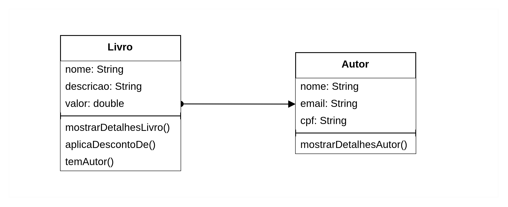

# Aula 01

## Paradigmas de programação: imperativa vs. orientada a objetos

### **Programação Imperativa**

Foco: **como** o programa realiza uma tarefa, ou seja, você escreve uma **sequência de instruções passo a passo** para o computador seguir.

**Características**:

- Código executado em sequência
- Uso intenso de variáveis, estruturas de controle (`if`, `for`, `while`)
- Manipulação direta do estado do programa

**Analogia**:

Imagine dar uma receita de bolo para alguém — passo a passo, você diz: "pegue 2 ovos, misture com açúcar, leve ao forno...". Cada instrução é executada na ordem em que foi escrita.

**Exemplo em Java (imperativo):**

```java
int a = 5;
int b = 10;
int soma = a + b;
System.out.println("A soma é: " + soma);
```

### **Programação Orientada a Objetos (POO)**

Foco: está em **quem** está realizando a ação. Você estrutura o código em torno de **objetos** — entidades que têm **dados (atributos)** e **ações (métodos)**.

**Características**:

- Usa conceitos como **classe, objeto, herança, polimorfismo, encapsulamento, abstração**
- Enfatiza a modelagem do mundo real
- Código mais modular, reutilizável e de fácil manutenção

## Definição de objeto

Coisa **material** ou **abstrata** que pode ser percebida pelos sentidos e descrita por meio das suas características, comportamentos e estado atual.

Ex de objeto: caneta

- Caracterísitcas: modelo, cor, ponta,carga, tampada → atributos
- Comportamentos: escrever, rabiscar, pintar, tampar, destampar → metodos
- Estado atual: Como a caneta está agora? Tampada, aberta, seca…

Objetos de exemplo a serem abordados:



## Denifição de classe

Uma classe é um molde, especificação que define para a máquina virtual o que um objeto desse tipo deverá ter e como ele deve se comportar. Também, define os atributos e métodos comuns que serão compartilhados por um objeto.

⚠️Uma classe não é necessariamente é um objeto.

Como crio um objeto? Instanciando uma classe! O objeto é uma instância de uma classe.

```java
public class Livro {
		String nome;
		String descricao;
		double valor;
} 
```

Para criar um objeto a partir do molde:

```java
Livro livro = new Livro();
```

Observações importantes:

- Abstração: quais são os atributos que importa no momento?!

### Comparação entre objetos

Quando criamos um novo objeto com a palavra `new`, como `new Autor()`, a variável não guarda as informações do autor (como nome ou e-mail), mas sim um caminho para acessar esse objeto na memória do computador. É como guardar o endereço de uma casa, e não a casa inteira.

Por isso, quando usamos `==`, estamos comparando os endereços, e não o conteúdo dos objetos. Como cada objeto novo tem um endereço diferente, mesmo que tenham os mesmos dados, `==` vai dizer que são diferentes.

```java
Autor autor = new Autor();
	autor.nome = "Isabela Nogueira";
	autor.email = "isabela@email.com";
	autor.cpf = "123.456.789.10";
        
Autor outroAutor = new Autor();
	outroAutor.nome = "Isabela Nogueira";
	outroAutor.email = "isabela@email.com";
	outroAutor.cpf = "123.456.789.10";
	

```

Na classe **App.class**:

```java
if (autor == outroAutor) {
	System.out.println("Mesmo autor!");
} else {
	System.out.println("Autores diferentes!");
}
```

O output impresso no console será: `Autores diferentes!`

### Métodos

- `void` → **não retorna nada** (só executa uma ação)

```java
 void mostrarDetalhesLivro() { 
		String mensagem = "Mostrando detalhes do livro: ";
    System.out.println(mensagem);
    System.out.println("Nome: " + nome);
    System.out.println("Descrição :" + descricao);
    System.out.println("Valor: R$" + valor);
  }
```

- Tipos primitivos → como `int`, `double`, `boolean`, etc.

```java
boolean temAutor() {

        boolean autorExiste;

        if (this.autor != null) {
            autorExiste = true;
        } else {
            autorExiste = false;
        }

        return autorExiste;
    }
```

- Objetos → retorna outro objeto, como String, Autor, List<Livro>, etc.

```java
Autor retornaAutor() {

        boolean autorExiste;

        if (this.autor != null) {
            System.out.println("O autor do livro é: " + this.autor.nome);
        } else {
            autorExiste = false;
            System.out.println("O livro não tem autor!");
        }

        return this.autor;
    }
```

## Construtor

Quando escrevemos a instrução Livro() seguida da palavra reservada
new, estamos pedindo para a JVM procurar a classe Livro e invocar o seu
construtor, que se parece com: 

Sempre que você
não criar um construtor para suas classes, o compilador fará isso para você.

```java
public class Livro {
	public Livro() {
	}
}
```

Características: 

- tem o mesmo nome da classe e não tem um retorno declarado.