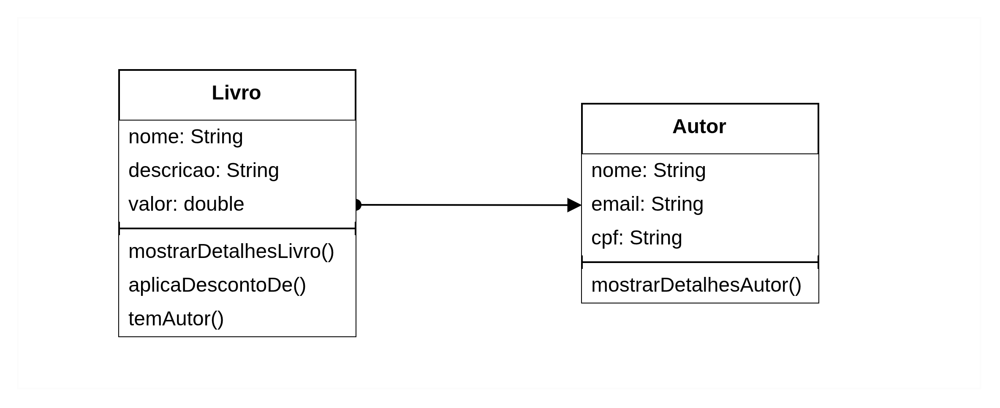

# Programação Orientada a Objetos

Foco: está em **quem** está realizando a ação. Você estrutura o código em torno de **objetos** — entidades que têm **dados (atributos)** e **ações (métodos)**.

**Características**:

- Usa conceitos como **classe, objeto, herança, polimorfismo, encapsulamento, abstração**
- Enfatiza a modelagem do mundo real
- Código modular, reutilizável e de fácil manutenção

## Definição de objeto

Coisa **material** ou **abstrata** que pode ser percebida pelos sentidos e descrita por meio das suas **características**, **comportamentos** e **estado atual**.

Ex de objeto: caneta

- **Caracterísitcas**: modelo, cor, ponta, carga, tampada → atributos
- **Comportamentos**: escrever, rabiscar, pintar, tampar, destampar → metodos
- **Estado atual**: Como a caneta está agora? Tampada, aberta, seca…

Objetos que serão abordados na aula:



## Denifição de classe

Uma classe é um **molde**, especificação que define para a máquina virtual o que um objeto desse tipo deverá ter e como ele deve se comportar. Também, **define os atributos e métodos** comuns que serão compartilhados por um objeto.

⚠️Uma classe não é necessariamente é um objeto.

Regras e boas práticas para nomear classes:
* Iniciar em letra maiúscula
* Seguir o padrão PascalCase
* O nome deve ser substantivo
* Evite usar acentos ou caracteres especiais
* Não use palavras reservadas
* Evite abreviações desnecessárias

Exemplo classe Livro:

```java
public class Livro {
    
    //atributos da classe
    
    String nome;
    String descricao;
    double valor;

    // métdodos
} 
```

Para cirar um objeto deve-se instanciar a classe. Por exemplo:

```java
Livro livro = new Livro();
```

## Comparação entre objetos

Quando criamos um novo objeto com a palavra `new`, como `new Livro()`, a variável não guarda as informações do livro (como nome ou descrição), mas sim um caminho para acessar esse objeto na memória do computador. É como guardar o endereço de uma casa, e não a casa inteira.

Por isso, quando usamos `==`, estamos comparando os endereços, e não o conteúdo dos objetos. Como cada objeto novo tem um endereço diferente, mesmo que tenham os mesmos dados, `==` vai dizer que são diferentes.

```java
Livro livro = new Livro();
livro.nmme = "Um defeito de cor";
livro.descricao = "Descrição do livro";
livro.valor = 60;


Autor outroLivro = new Autor();
outroLivro.nmme = "Um defeito de cor";
outroLivro.descricao = "Descrição do livro";
outroLivro.valor = 60;

```

Na classe **App.class**:

```java
if (livro == outroLivro) {
	System.out.println("Mesmo livro!");
} else {
	System.out.println("Livros diferentes!");
}
```

Será impresso no console será: `Autores diferentes!`

## Métodos

Métodos em Java são blocos de código que **realizam uma ação** específica e podem ser reutilizados. Eles definem o **comportamento** de um objeto.

Regras e boas práticas para nomear classes:
* Comece com letra minúscula
* Seguir o padrão PascalCase
* Use nomes no singular
* Não inclua tipo de retorno


### Tipos de retorno

- `void` → **não retorna nada** (só executa uma ação)

```java
    void mostrarDetalhesLivro() { 
		String mensagem = "Mostrando detalhes do livro: ";
        System.out.println(mensagem);
        System.out.println("Nome: " + nome);
        System.out.println("Descrição :" + descricao);
        System.out.println("Valor: R$" + valor);
  }
```

- Tipos primitivos → como `int`, `double`, `boolean`, etc.

Exemplo:
```java
boolean temAutor() {

        boolean autorExiste;

        if (this.autor != null) {
            autorExiste = true;
        } else {
            autorExiste = false;
        }

        return autorExiste;
    }
```

- Objetos → retorna outro objeto, como `String`, `Autor`, `List<Livro>`, etc.

```java
Autor retornaAutor() {

        boolean autorExiste;

        if (this.autor != null) {
            System.out.println("O autor do livro é: " + this.autor.nome);
        } else {
            autorExiste = false;
            System.out.println("O livro não tem autor!");
        }

        return this.autor;
    }
```

## Construtor

O construtor é um **método especial** usado para criar e inicializar objetos de uma classe. Por exemplo, quando escrevemos a instrução `Livro()` seguida da palavra reservada `new` estamos pedindo para a JVM procurar a classe `Livro` e invocar o seu construtor, que se parece com:

```java
public class Livro {
	
    public Livro() {
	
    }
}
```
### Características
* Tem o mesmo nome da classe
* Não possui um tipo de retorno
* Pode ter parâmetros ou não

Se não for criado um construtor para a classes, o compilador fará isso para você.

### Tipos de construtor


* Construtor vazio:

O construtor vazio (ou construtor padrão) é um construtor **sem parâmetros**, usado para criar objetos sem exigir dados na criação.

```java
public class Livro {

    public Livro() {
        System.out.println("Construtor padrão chamado");
    }
}
```

⚠️ Se você criar qualquer construtor, o Java não cria mais o construtor vazio automaticamente. Se quiser usá-lo, deve-se criar manualmente na classe.

* Construtor com Parâmetros

É um construtor que recebe valores para inicializar os atributos do objeto no momento da criação.

 ```java
 public class Livro {
    
    String nome;
    String descricao;
    double valor;

    public Pessoa(String nome, String descricao, double valor) {
        this.nome = nome;
        this.descricao = descricao;
        this.valor = valor;
    }
}
 ```

 * Construtores Sobrecargados (Overloaded)

 Vários construtores na mesma classe, com quantidades ou tipos diferentes de parâmetros. Isso é chamado de sobrecarga de construtores.

 ```java
public class Pessoa {
    private String nome;
    private int idade;

    public Pessoa() {
        // Construtor vazio
    }

    public Pessoa(String nome) {
        this.nome = nome;
    }

    public Pessoa(String nome, int idade) {
        this.nome = nome;
        this.idade = idade;
    }
}
 ```