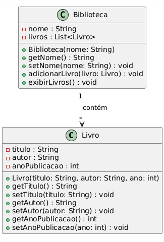

# Exercícios

## Exercício 1
Crie a classe `Pessoa` com os atributos privados:

```java
private String nome;
private int idade;
```

* Crie os métodos get e set, e um construtor com parâmetros.
* Na classe `App`, crie uma lista do tipo `List<Pessoa>` e adicione 3 pessoas.
* Imprima o nome e a idade de cada pessoa usando for.
* Imprima somente os dados das pessoas com idade maior ou igual a 18
* Imprima o primeiro e o último elemento da lista
* Imprima a quantidade de pessoas na lista utilizando o método `size()`

## Exercício 2
Crie a classe `Produto` com os atributos:

```java
private String nome;
private double preco;
```
* Crie um construtor com parâmetros e os métodos get e set.

* Crie uma lista de produtos (List<Produto>) e adicione 3 produtos.

* Percorra a lista e imprima o nome e o preço de cada produto.
* Some os preços de todos os produtos da lista e imprima o valor total
* Crie o método `exibirInfo()` que imprima:

        Produto: <nome> - Preço: R$ <preco>


## Exercício 3

Ainda na classe `Produto` do exercício anterior, erie uma lista com 3 objetos `Produto`

* Atualize o preço de um produto da lista usando `setPreco()`

* Imprima a lista novamente com os valores atualizados


## Exercício 4

Crie uma lista com os nomes: Ana, Bruno, Carla, Diego

Remova o nome “Bruno” usando o método `remove()`

Imprima a lista após a remoção


## Exercício 5

Crie uma lista com frutas: Maçã, Banana, Uva

Verifique se “Banana” está na lista usando o método `contains()`

Imprima uma mensagem:

“Está na lista” ou

“Não está na lista”

## Exercício 6

Crie uma classe `Livro` com os atributos:

```java
private String titulo;
private String autor;
```
* Crie uma lista de livros `List<Livro>`

* Adicione 3 livros à lista

* Imprima os títulos dos livros usando um for-each

## Exercício 7

Crie uma lista de números inteiros

Adicione os números: 5, 1, 8, 3, 2

Ordene a lista com `Collections.sort()`

Imprima a lista ordenada

## Exercício 8

Crie uma lista com nomes

Use um `for` com índice `for (int i = 0; i < list.size(); i++)`

Imprima:
```
Posição X: nome
```

## Exercicio 9

Você vai criar um sistema simples de gerenciamento de Biblioteca.

Teremos as classes:

`Livro` cujos atributos são:
```java
Título
Autor
Ano de publicação
```

`Biblioteca`

Uma `Biblioteca` pode ter um ou mais livros.

Implemente métodos para:

- Adicionar livros à biblioteca

- Exibir todos os livros cadastrados

Diagrama UML das classes:


